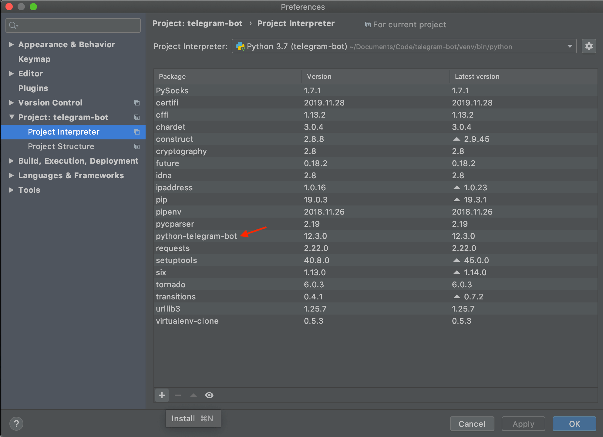
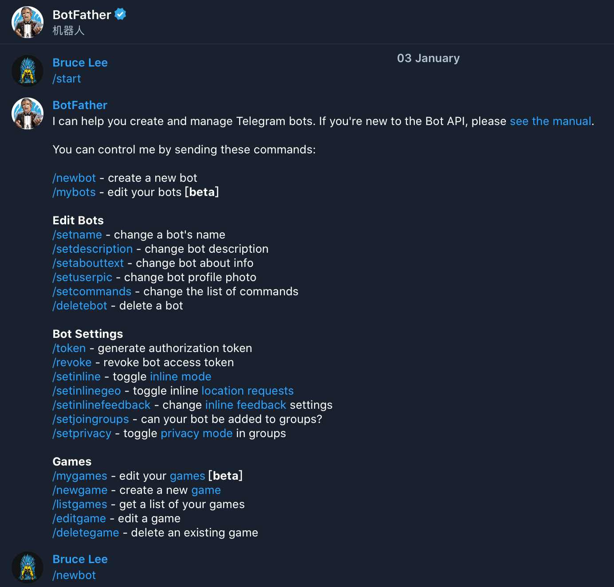
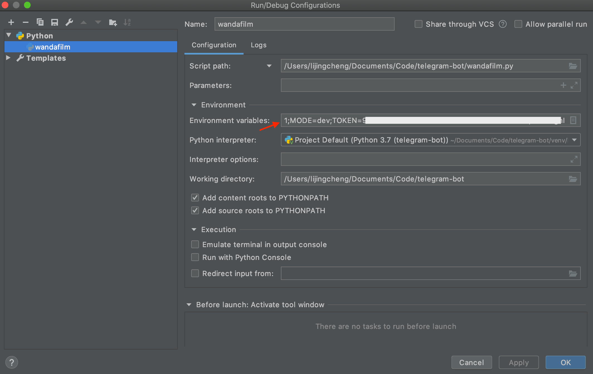

Telegram 是一款非常优秀的聊天软件，它非常重视用户隐私并对所有聊天信息进行加密并做永久存储，它还提供了种类丰富的群组和机器人，机器人是通过程序运作的账号，可以回复我们发送的消息，还可以提供消息的定时推送功能，例如推送新闻、天气预报、提醒事项等。

Telegram 官方为了让开发者能够参与到机器人的开发，还免费提供了功能齐全的 [API](https://core.telegram.org/bots/api)，我们可以用它创建自己的机器人，下面介绍下如何创建和部署机器人程序。

# 准备工作
Telegram 支持多种语言来编写机器人，相对来说使用 Python 的比较多，并且有比较成熟的第三方库 [python-telegram-bot](https://github.com/python-telegram-bot/python-telegram-bot) 供选择使用，所以建议花点时间学习下 Python，掌握基本的开发方式和语法后就可以上手了，然后在开发过程中再去慢慢解决遇到的问题。

建议使用 PyCharm 作为 IDE 来编写程序，这样不仅可以在编写代码时有语法高亮和自动提示，而且还可以更方便的添加第三方库和包管理器，默认的包管理器是 pip，我们可以换成 pipenv，它会自动帮你管理虚拟环境和依赖文件。



下面列出几条 Python 语法中比较特别的地方

- 代码缩进非常重要，同一代码块中的多行代码强制使用相同数量的空格，否则程序会编译不过
- 定义变量用 x = 5 就可以了，不用声明是常量还是变量，并且 x 作为 int 类型时，它的长度不受限制
- python 中的字符串可以直接当数组来用，例： z = 'abcdefg'  z[0] = a, z[1:3] = bc
- if 语句中可使用 in 或 not in 关键字，例：if 'ab' in 'abcd'
- ['a', 'b', 'c'] 是 Array，('a', 'b', 'c') 是 Set
- 操作数组时索引可以是负数，表示从数组的后面开始按索引查找数据

# 创建机器人
在 Telegram 应用中通过与 [@BotFather](https://telegram.me/BotFather) 交谈来创建自己的机器人，具体方式跟着引导来操作就可以了，需要注意的是每个机器人都会对应一个 Token，机器人的所有信息交互都会用到它，所以要保管好不要泄漏，避免其他人也能使用你的机器人做事情，创建机器人后可用链接 `https://api.telegram.org/bot<token>/getMe` 在浏览器里查看机器人信息，并能够看到以下反馈信息。

```
{
    "ok": true,
    "result": {
        "id": 985878205,
        "is_bot": true,
        "first_name": "万达电影 iOS 团队",
        "username": "WandaFilm_Bot"
    }
}
```

通过与 BotFather 交谈还能实现很多功能，详见以下图片内容



# 举个例子
下面这个简单例子可以使机器人能够响应 /start 和 /help 命令，还能够在收到聊天信息时进行回复，需要注意的是，如果你需要 VPN 才能够使用 Telegram，那么在机器人程序里你需要将 VPN 软件中的代理设置写在代码里。

```python
from telegram.ext import Updater, CommandHandler, MessageHandler, Filters

def start(update, context):
    update.message.reply_text('Hi!')

def help(update, context):
    update.message.reply_text('Help!')

def echo(update, context):
    update.message.reply_text(update.message.text)

def error(update, context):
    logger.warning('Update "%s" caused error "%s"', update, context.error)

if __name__ == '__main__':
    updater = Updater('<token>', use_context=True, request_kwargs={
        'proxy_url': 'socks5://127.0.0.1:1086/'
    })

    dispatcher = updater.dispatcher

    dispatcher.add_handler(CommandHandler("start", start))
    dispatcher.add_handler(CommandHandler("help", help))

    dispatcher.add_handler(MessageHandler(Filters.text, echo))

    dispatcher.add_error_handler(error)

    updater.start_polling()
    updater.idle()
```

想要了解机器人都能够做些什么事情，可以参考官方提供的 [API](https://core.telegram.org/bots/api)，还可以参考 `python-telegram-bot` 提供的 [文档](https://python-telegram-bot.readthedocs.io/en/latest/index.html) 和 [Wiki](https://github.com/python-telegram-bot/python-telegram-bot/wiki)，最后就是发挥你的想象力了～

# 部署
目前 Telegram 机器人支持两种获取用户消息的方法

- Long Polling：每隔一段时间通过 getUpdates 获取消息，缺点是会有延迟

- Webhook：需要设置一个 HTTPS 协议的回调 URL，当有人给机器人发消息时，Telegram 会把消息发送到这个 URL 上，缺点是麻烦一些

下面介绍在使用 Webhook 方式时，如何用最简单的方式将我们的机器人程序部署到 [Herku](heroku.com) 云平台所提供的回调地址上

- 将机器人程序代码放到 GitHub 仓库中，注意不要暴露机器人的 Token，需要提交的仓库中的文件如下
    - bot.py：编写机器人程序的代码文件
    - runtime.txt：描述所使用 python 语言版本的文件
    - requirements.txt：记录程序所使用第三方库的名称和版本号
    - Procfile：记录机器人程序代码所在的文件名
    
- 在 Heroku 上注册账号并创建项目，然后再进行以下设置
    - 关联机器人程序所在的 GitHub 仓库和代码分支，目的是当你提交代码到该分支后能够自动部署
    - 将一些如机器人 Token 这类的私密信息以环境变量的形式配置在 Heroku 提供的对应页面中，然后在代码中读取并使用，在本地开发调试程序时也需要将此类信息通过 PyCharm 配置到环境变量中



完整的例子可以参考 bot.py 文件

